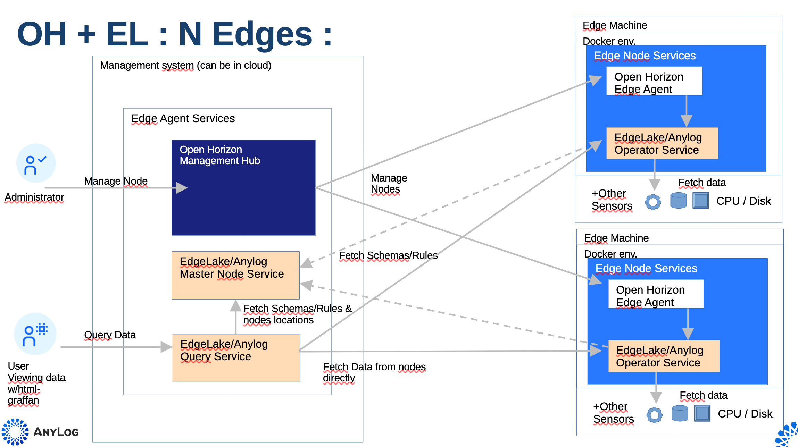

# AnyLog Service for OpenHorizon

AnyLog is a decentralized network to manage IoT/Edge data. Nodes are compute instances that execute the AnyLog
software and are part of a nodes network.

The AnyLog network uses one **Master** node (holds all network metadata), as many **Operator** nodes as required
(where data is stored), and at least one **Query** node (where queries are made — nodes can be dual-role
Query+Operator). The Query node knows from the metadata which Operators to contact and queries them peer-to-peer.

> **Note:** The Master node can also be replaced by a Blockchain service & contract — not covered here.

Adding AnyLog to Open Horizon deployments extends OH value by:
- Simple collection of node health data
- Extending queried data to other sensors useful to the user (e.g. machine RPMs)

---

## Architecture

In a typical Open Horizon deployment here are the main elements: 


The simplest pattern for adding AnyLog is to co-locate the Master and Query nodes with the OH Management Hub:


A more practical approach puts the Query node(s) elsewhere, avoiding moving data to the Management Hub (peer-to-peer
collection). Multiple Query nodes are supported:


For demonstrating and testing on a single physical system:


---

## Repository Structure

```
anylog-service/
├── Makefile
├── service.definition.json        ← base template (never modified directly)
├── service.policy.json            ← base template
├── node.policy.json               ← base template
└── docker-makefiles/
    ├── env2json.sh                ← generates per-instance JSON policy files
    ├── env2json.py                ← Python equivalent of env2json.sh
    ├── prep_configs.sh
    ├── build_docker_compose.sh
    ├── docker-compose-files/
    │   └── <ANYLOG_TYPE>-docker-compose.yaml
    └── <ANYLOG_TYPE>/             ← one directory per node instance
        ├── node_configs.env       ← user-edited configuration
        ├── service.definition.json  ← generated by prep-service
        ├── service.policy.json      ← generated by prep-service
        └── node.policy.json         ← generated by prep-service
```

Each `<ANYLOG_TYPE>` directory is self-contained. Multiple instances (e.g. `anylog-generic`, `anylog-operator`,
`anylog-master`) can coexist on the same machine without conflicts — every `prep-service` run writes its JSON
files into its own subdirectory, using the `NODE_NAME` from that instance's `.env` as the service identity.

---

## Prerequisites

| Tool | Required for |
|---|---|
| `docker` or `podman` | All container operations |
| `docker compose` / `docker-compose` / `podman-compose` | Docker compose targets |
| `jq` | `prep-service` (JSON policy generation) |
| `hzn` (Open Horizon CLI) | All `publish-*`, `agent-run`, `deploy-check` targets |

The Makefile auto-detects `docker` vs `podman` and `docker compose` vs `docker-compose` vs `podman-compose`.
`hzn` is optional — all Docker compose targets work without it.

---

## Configuration

Each node type has its own directory under `docker-makefiles/` containing a `node_configs.env` file.
The key variables read at make-time are:

| Variable in `.env` | Purpose |
|---|---|
| `NODE_NAME` | Sets the container name and OpenHorizon service identity |
| `IMAGE` | Docker image repo (e.g. `anylogco/anylog-network`) |

All other variables are passed through to the container at runtime.

### Makefile variables

| Variable | Default | Description |
|---|---|---|
| `ANYLOG_TYPE` | *(required)* | Subdirectory name under `docker-makefiles/` |
| `TAG` | `pre-develop` | Docker image tag |
| `HZN_ORG_ID` | `myorg` | OpenHorizon organisation ID |
| `SERVICE_VERSION` | `1.3.5` | OH service version |
| `HZN_EXCHANGE_USER_AUTH` | *(required for publish)* | OH exchange credentials |

---

## Usage

### Docker Compose
set license key in the appropriate version of node_configs.env file.  
```bash
# Preview — generate docker-compose.yaml without starting
make dry-run ANYLOG_TYPE=anylog-generic

# Start
make up ANYLOG_TYPE=anylog-generic TAG=latest

# Stop
make down ANYLOG_TYPE=anylog-generic

# Stop and remove volumes
make clean ANYLOG_TYPE=anylog-generic

# Stop, remove volumes and image
make clean-all ANYLOG_TYPE=anylog-generic

# Logs
make logs   ANYLOG_TYPE=anylog-generic
make logs-f ANYLOG_TYPE=anylog-generic   # follow
```

### OpenHorizon

```bash
# set service version
export SERVICE_VERSION=1.1

# Generate service.definition.json, service.policy.json and node.policy.json
# into docker-makefiles/<ANYLOG_TYPE>/
make prep-service ANYLOG_TYPE=anylog-generic TAG=latest

# Publish service + policies, then register the agent (full workflow)
make full-deploy ANYLOG_TYPE=anylog-generic TAG=latest

# Publish only
make publish ANYLOG_TYPE=anylog-generic

# Register agent against already-published policies
make deploy ANYLOG_TYPE=anylog-generic

# Unregister agent
make hzn-clean

# Check agreement list
make hzn-agreement-list

# Validate deployment against all policy files
make deploy-check ANYLOG_TYPE=anylog-generic
```

Multiple instances on the same machine — each with its own identity and policy files:

```bash
make prep-service ANYLOG_TYPE=anylog-master    TAG=latest
make prep-service ANYLOG_TYPE=anylog-operator  TAG=pre-develop
make prep-service ANYLOG_TYPE=anylog-query     TAG=latest
```

Set new policy on Open Horizon node

```bash
hzn unregister
hzn register -n nodename -f docker-makefiles/node-type/node.policy.json
```

### Diagnostics

```bash
# Show all resolved variable values
make check-vars ANYLOG_TYPE=anylog-generic

# Attach to running container
make attach ANYLOG_TYPE=anylog-generic

# Open bash shell in container
make exec ANYLOG_TYPE=anylog-generic
```

---

## Table of Contents

* [Install OpenHorizon](Documentation/Install_Local_OpenHorizon.md)
* [Deploy AnyLog](deploy_anylog_service.md)
* [AnyLog KubeArmor Integration](Documentation/AnyLog_KubeArmor_integration.md)
* [Import Grafana Dashboards](Documentation/Import_Grafana_Dashboards.md)

---

## 📌 Our valuable contributors 👩‍💻👨‍💻

<table>
  <tr>
    <a href="https://github.com/open-horizon-services/service-anylog/graphs/contributors">
      
    </a>
  </tr>
</table>
